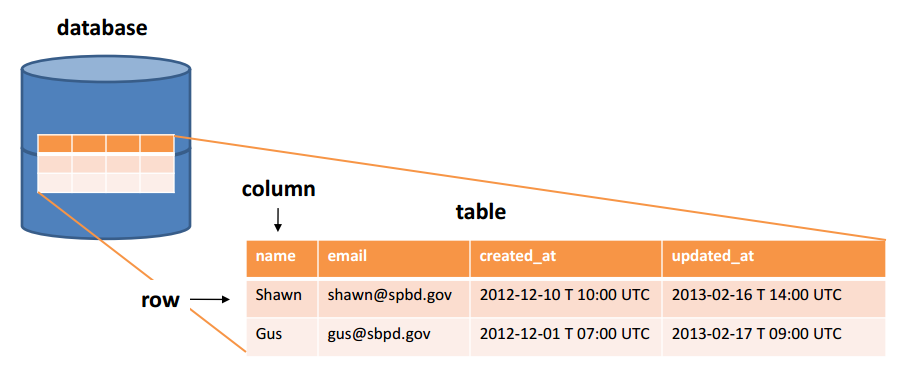

# RELATIONAL DATABASES

Lighthouse (W04D06)

Notes from [codetutsplus.com](https://code.tutsplus.com/tutorials/relational-databases-for-dummies--net-30244) article, "Relational Databases for Dummies"

A database stores data in an organized way so that it can be searched and retrieved later. It should contain one or more tables (much like a spreadsheet) made up of columns and rows.

Fig. 1

Data can be Created, Retrieved, Updated or Deleted (CRUD).

A relational database organizes data into tables and links them, based on defined relationships. This allows us to retrieve and combine data from one or more tables in a single query.

## SQL

### SQL Order of Execution

| ORDER  | CLAUSE    | FUNCTION                                |
| ------ | --------- | --------------------------------------- |
| 1      | from      | Choose and join tables to get base data |
| 2      | where     | Filters the base data                   |
| 3      | group by  | Aggregates the base data                |
| 4      | having    | Filters the aggregated data             |
| 5      | select    | Returns the final data                  |
| 6      | order by  | Sorts the final data                    |
| 7      | limit     | Limits the returned data to a row count |

 

## JOIN

[Coding Horror - Visual Explanation of SQL Joins](https://blog.codinghorror.com/a-visual-explanation-of-sql-joins/)

